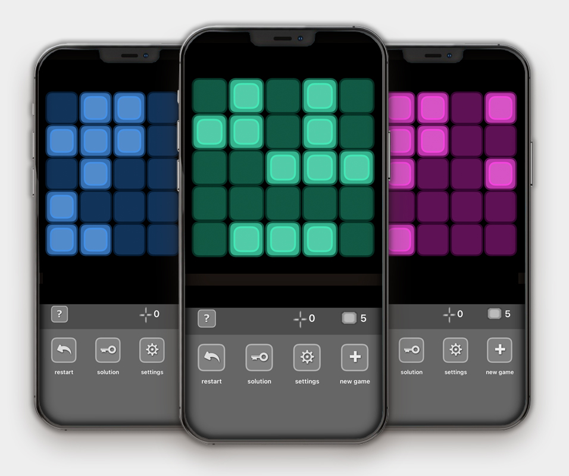

# LightBurst
A graphic puzzle game written in Objective C for the iPhone, iPad, and any iOS device, available on the AppStore.




## Table of contents
<!-- 1. [Installation](#Installation)
2. [Usage](#Usage)
3. [Live Demo](#Live_Demo) -->
1. [Features](#Features)
2. [Technology](#Technology)
3. [Usage Rights & Copyright](#Rights)
<!-- 3. [User Story](#User_Story)
4. [Contributors](#Contributors)
5. [Badges](#Badges) -->
<!-- 
<a name="Installation"></a>
## Installation
```sh
X-Code
```

<a name="Live_Demo"></a>
## Live Demo
<a href="https://shielded-crag-85117.herokuapp.com/">Live Demo on Heroku</a> -->

<a name="Features"></a>
## Features
1. Settings Panel allows user to adjust game panel size, color and game difficulty levels
2. Two-finger swipe rotates the game-board
3. Option for showing game solution

<a name="Technology"></a>
## Technology
1. Objective C
2. ToolKit / iOS
3. X-Code

<!-- <a name="User_Story"></a>
## User Story
```sh
As an avid reader, I want to be able to store my own list of books that are available on Google Books, and then be able to easily access them at a later date.
``` -->

<a name="Rights"></a>
## Usage Rights
All Rights reserved.  © Copyright 2020 by Bart Dority.

**on github:** <a href='github.com/b0rgBart3'>b0rgBart3</a>

[](https://github.com/remarkablemark)

Email: borgBart3@gmail.com

